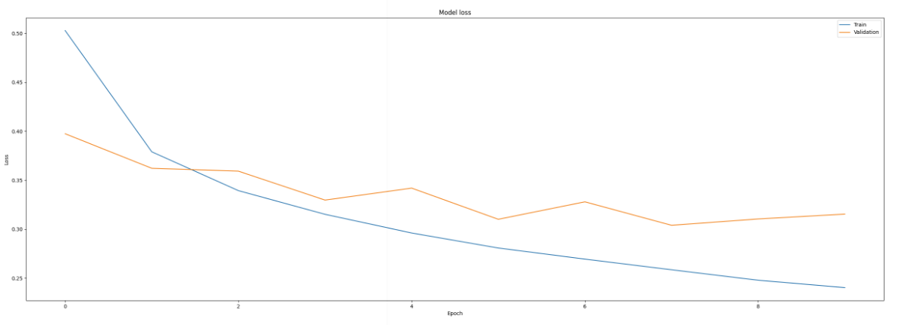
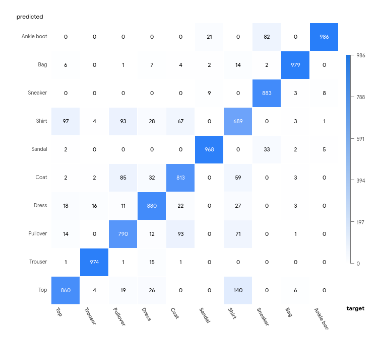
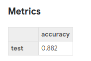

# SAME Example: Fashion MNIST Clothing Category Prediction

> **This is a work in progress!**

## Usage

Create a working SAME installation by [following instructions found in the wiki](https://github.com/azure-octo/same-cli/wiki/Epic-Sprint-1-Demo), but stop before the "Run a program" section. Then run the following commands:

```bash
git clone https://github.com/SAME-Project/example-kubeflow-fashionMNIST
cd example-kubeflow-fashionMNIST
same program create -f same.yaml
same program run -f same.yaml --experiment-name example-kubeflow-fashionMNIST --run-name default
```

Now browse to your kubeflow installation and you should be able to see an experiment and a run.

## Project description

In this section, we will walk you through the steps of converting a machine learning model, which you may already have on a jupyter notebook, into a Kubeflow pipeline. As an example, we will make use of the fashion we will make use of the fashion MNIST dataset and the [Basic classification with Tensorflow](https://www.tensorflow.org/tutorials/keras/classification) example.

In this example we use:

* **Kubeflow pipelines** - [Kubeflow Pipelines](https://www.kubeflow.org/docs/pipelines/overview/pipelines-overview/) is a machine learning workflow platform that is helping data scientists and ML engineers tackle experimentation and productionization of ML workloads. It allows users to easily orchestrate scalable workloads using an SDK right from the comfort of a Jupyter Notebook.

**Note:** This notebook is to be run on a notebook server inside the Kubeflow environment.

The [Fashion MNIST](https://github.com/zalandoresearch/fashion-mnist)  dataset contains 70,000 grayscale images in 10 clothing categories. Each image is 28x28 pixels in size. We chose this dataset to demonstrate the funtionality of Kubeflow Pipelines without introducing too much complexity in the implementation of the ML model.

To familiarize you with the dataset we will do a short exploration. It is always a good idea to understand your data before you begin any kind of analysis.

# Pipeline parameters #
| Pipeline parameter | Description |
| ------ | ------ |
|compile_optimizer| String (name of optimizer) or optimizer instance. See tf.keras.optimizers. (e.g "adam")|
|epochs| Integer. Number of epochs to train the model. (e.g 50)|
|validation_split| Float between 0 and 1. Can't be 0. Fraction of the training data to be used as validation data(e.g 0.1)|

# Pipeline stages #

##### 1. Train ([code](./src/train.py))
This component performs the following operations:

    1. Loads the keras dataset
    2. Uses the training set to train a model
    3. Save the model in an OutputPath Artifact.
    4. Generate a loss plot, saves it in an OutputArtifact and embed its visualization inside a web-app component.

##### 2. Test ([code](./src/test.py))
This component performs the following operations:

    1. Loads the previously saved model through an InputPath Artifact.
    2. Uses the testing set to test the model.
    3. Saves the image, prediction and confidence inside a file generated as an OutputPath Artifact(results_path).
    4. Saves true and predicted labels, as well as class names to pass it later     to the confusion matrix.
    5. Generate accuracy as metrics

##### 3. Confusion matrix ([code](./src/confusion_matrix.py))
This component is passed the labels directory(which contains true and predicted labels, as well as class names) and generates a confusion matrix that kubeflow UI can understand.This function can be reused in other pipelines if given the appropiate parameters.

# File generation #
To generate the pipeline from the python file, execute the following command:

```python3 pipeline.py```

pipeline.py is located inside src folder. The pipeline will be created at the same directory that the command is executed.

Also, if you want to run all tests locally, execute:
```python3 -m unittest tests/*_test.py```

Once the pipeline has been created, we can upload the generated zip file in kubeflow UI and create runs of it.

# Experimental results #

In this section we will replicate the results for the fashion experiment.
The pipeline outputs are a confusion matrix ,a loss plot and metrics for the accuracy of the model, from which metrics can be directly compared.
We can see them in the visualizations of the pipeline or in the Run Output Tab of the Run.

In order to check the validity of the pipeline, we are going to execute a run with the same parameters as the original experiment and compare the outputs with the ones obtained in [Basic classification: Classify images of clothing"](https://www.tensorflow.org/tutorials/keras/classification#evaluate_accuracy). As we can't put the validation split parameter to 0 (as we need some values to do the loss plot), we will put a very small value (0.05).

### Input parameters ###
| Pipeline parameter | Value |
| ------ | ------ |
|compile_optimizer|adam|
|epochs|10|
|validation_split|0.05|

### Loss plot ###



### Confusion Matrix ###



### Metrics ###
The original results are shown in https://www.tensorflow.org/tutorials/keras/classification#evaluate_accuracy. In particular, the results for the the fashion task are an accuracy of 0.8693000078201294

In our replication, we get similar results:


If we increase the number of epochs to 100, and the validation split to 0.10, the results remain more or less the same: 0.8819

# Acknowledgements

This work is based on the github project [From Notebook to Kubeflow Pipeline using Fashion MNIST](https://github.com/manceps/fashion-mnist-kfp-lab/blob/master/KF_Fashion_MNIST.ipynb) under the [MIT License](https://github.com/manceps/fashion-mnist-kfp-lab/blob/master/LICENSE).

